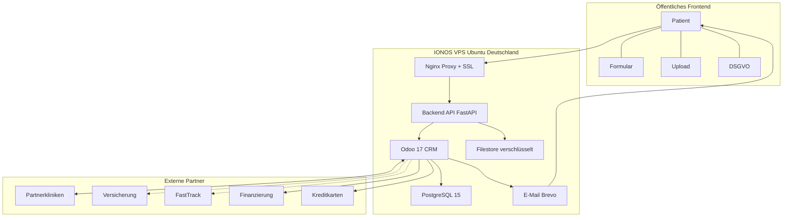
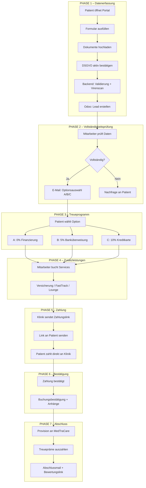
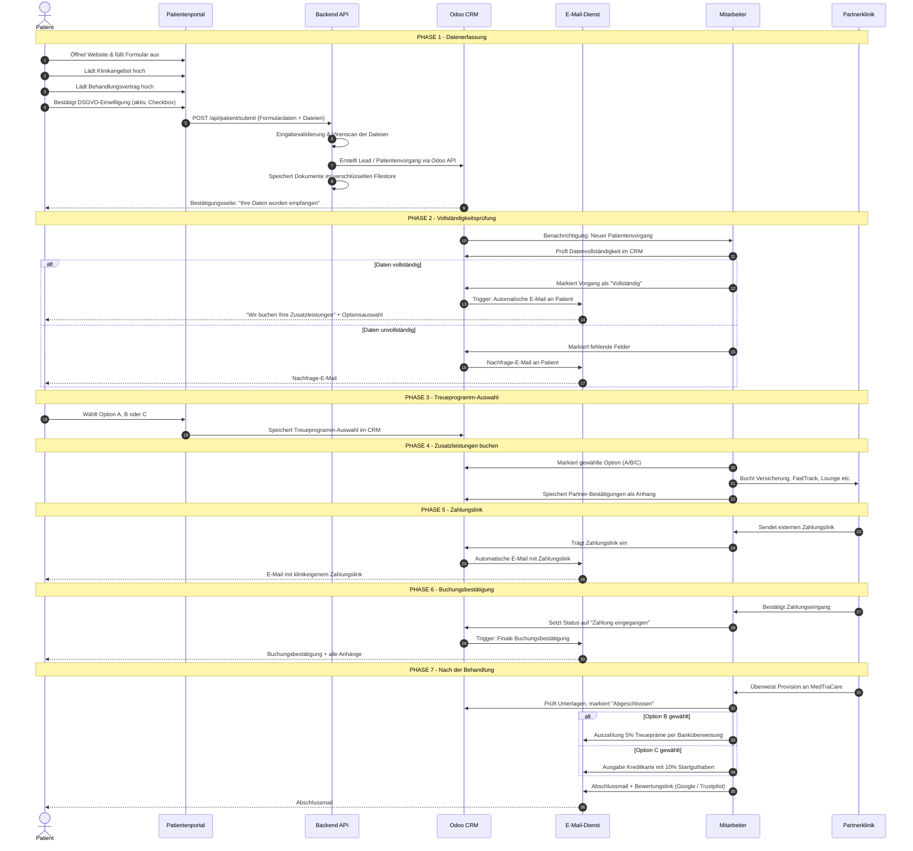
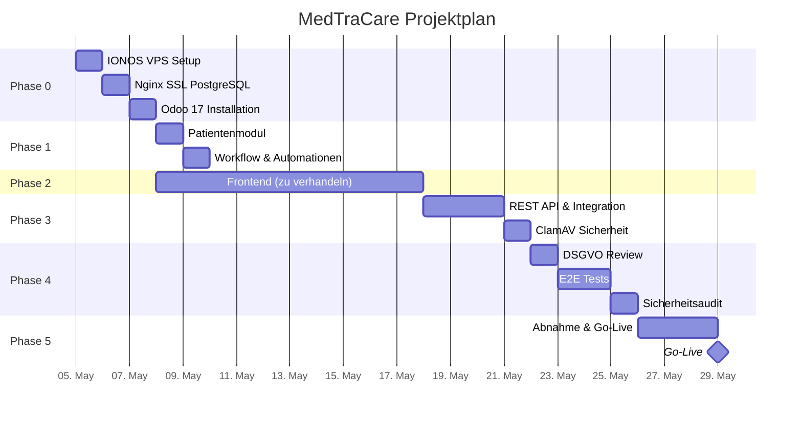

# Implementierungsplan: MedTraCare – Digitales Patientenportal & CRM-Integration

**Erstellt von:** [Ihr Name]  
**Datum:** 20. April 2026  
**Version:** 1.0  
**Projekttyp:** Webbasiertes Patientenportal mit Odoo CRM, DSGVO-konform  

---

## 1. Projektzusammenfassung

Ziel dieses Projektes ist die Entwicklung einer vollständig digitalen, DSGVO-konformen Lösung für MedTraCare, die:

- Patienten eine strukturierte Möglichkeit bietet, ihre Klinikdokumente hochzuladen und Daten zu erfassen
- alle Patientenvorgänge automatisch in ein zentrales Odoo-CRM überträgt
- Mitarbeiter durch einen klaren, nachvollziehbaren Workflow unterstützt
- Treueprogramme (Finanzierung, Cashback, Kreditkarte) abwickelt
- automatisierte, rechtssichere Kommunikation mit dem Patienten sicherstellt
- jederzeit erweiterbar ist (API-Anbindungen, Partner-Schnittstellen)

Die gesamte Infrastruktur wird auf einem **IONOS VPS (Ubuntu)** betrieben und entspricht vollständig der **DSGVO**.

---

## 2. Gesamtarchitektur



---

## 3. Patient Journey – Prozessablauf (7 Phasen)



---

## 3.2 Detaillierter Sequenzieller Datenfluss

Dieses Diagramm zeigt die technischen Interaktionen und Systemaufrufe zwischen den Akteuren in den verschiedenen Phasen des Prozesses.



---

## 4. Technischer Stack

| Komponente | Technologie | Begründung |
|---|---|---|
| **Webserver** | Nginx | Reverse Proxy, SSL-Terminierung, hohe Performance |
| **SSL-Zertifikat** | Let's Encrypt (Certbot) | Kostenfrei, automatisch erneuert, DSGVO-konform |
| **Backend API** | Python (FastAPI) | Schnell, modern, ideal für Odoo-Integration |
| **CRM** | Odoo 17 Community | Open Source, vollständig anpassbar, DSGVO-konform |
| **Datenbank** | PostgreSQL 15 | Enterprise-grade, von Odoo nativ verwendet |
| **Datei-Speicher** | Odoo Filestore (verschlüsselt) | Dokumente direkt im CRM verknüpft |
| **E-Mail** | Brevo / SendGrid + SMTP | Zuverlässige Zustellung, DSGVO-konform |
| **Server** | IONOS VPS (Ubuntu 22.04 LTS) | Rechenzentrum in Deutschland, DSGVO-konform |
| **Backup** | Tägliches Backup via IONOS Snapshots + pg_dump | Datensicherheit |
| **Monitoring** | Uptime Kuma oder Netdata | Systemüberwachung, Alarmierung |

---

## 5. Detaillierte Implementierungsschritte

### Phase 0 – Infrastruktur & Setup (2 Tage)

- [ ] IONOS VPS bestellen und Ubuntu 22.04 LTS installieren
- [ ] Server-Hardening (SSH-Key-Only, Fail2Ban, UFW Firewall)
- [ ] Nginx installieren und konfigurieren
- [ ] SSL-Zertifikat via Let's Encrypt einrichten (automatische Erneuerung)
- [ ] PostgreSQL 15 installieren, Benutzer und Datenbank für Odoo anlegen
- [ ] Odoo 17 Community installieren und Grundkonfiguration vornehmen
- [ ] Backup-Strategie einrichten (täglich, Off-Site via IONOS Object Storage)

---

### Phase 1 – Odoo CRM Konfiguration (2 Tage)

#### 1.1 Benutzerdefiniertes Patientenmodell

Ein erweitertes CRM-Lead-Modell wird in einem benutzerdefinierten Odoo-Modul (`medtracare_patient`) implementiert:

| Feld | Typ | Beschreibung |
|---|---|---|
| `patient_first_name` | Char | Vorname (Pflicht) |
| `patient_last_name` | Char | Nachname (Pflicht) |
| `patient_address` | Text | Anschrift (Pflicht) |
| `patient_email` | Char | E-Mail (Pflicht, validiert) |
| `patient_phone` | Char | Telefon (Pflicht) |
| `clinic_id` | Many2one → res.partner | Behandelnde Klinik (Dropdown, nur Partnerkliniken) |
| `treatment_ids` | Many2many → med.treatment | Behandlungsarten (max. 3 auswählbar) |
| `surgery_date` | Date | OP-Datum (Pflicht) |
| `clinic_offer` | Binary / Attachment | Upload Klinikangebot |
| `treatment_contract` | Binary / Attachment | Upload Behandlungsvertrag |
| `gdpr_consent` | Boolean | DSGVO-Einwilligung (Pflicht, protokolliert) |
| `gdpr_consent_date` | Datetime | Zeitstempel der Einwilligung |
| `loyalty_choice` | Selection (A/B/C) | Treueprogramm-Auswahl |
| `payment_link` | Char | Externer Zahlungslink der Klinik |
| `passport_data` | Text | Reispassdaten (verschlüsselt) |
| `flight_data` | Text | Flugdaten (für FastTrack) |
| `stage_id` | Many2one → crm.stage | Status-Workflow |

#### 1.2 CRM Status-Workflow (Kanban-Phasen)

```
[Neu eingegangen] → [In Prüfung] → [Vollständig] → [Zusatzleistungen gebucht]
→ [Zahlungslink gesendet] → [Zahlung eingegangen] → [Behandlung abgeschlossen]
→ [Treueprogramm ausgezahlt] → [Abgeschlossen]
```

#### 1.3 Automatisierte E-Mail-Vorlagen in Odoo

1. **Eingangsbestätigung** – "Ihre Daten wurden empfangen"
2. **Zusatzleistungs-E-Mail** – Mit Auswahloptionen A/B/C
3. **Zahlungslink-E-Mail** – Mit externem Klinik-Zahlungslink
4. **Buchungsbestätigung** – Mit allen Anhängen
5. **Abschluss-E-Mail** – Treueprogramm + Google/Trustpilot Bewertungslink
6. **Nachfrage-E-Mail** – Bei unvollständigen Daten

---

### Phase 2 – Patientenportal (Frontend) (zu verhandeln)

#### 2.1 Formular-Seite (Schritt-für-Schritt, mehrstufig)

**Stufe 1:** Persönliche Daten (Vorname, Nachname, Anschrift, E-Mail, Telefon)  
**Stufe 2:** Behandlungsdaten (Klinik-Dropdown, Behandlungsarten max. 3, OP-Datum)  
**Stufe 3:** Dokument-Upload (Klinikangebot + Behandlungsvertrag, max. 10 MB)  
**Stufe 4:** DSGVO & Bestätigung (aktive Checkbox, nicht vorausgefüllt)

#### 2.2 UX / Design-Anforderungen

- Mobil-optimiert (Responsive Design)
- Klare Fehlerhinweise bei Pflichtfeldern
- Fortschrittsbalken (Schritt 1 von 4)
- Ladeanimation beim Absenden
- Erfolgsmeldung nach Formular-Übermittlung

---

### Phase 3 – Backend API & Odoo-Integration (3 Tage)

#### 3.1 REST API Endpunkte

| Endpunkt | Methode | Beschreibung |
|---|---|---|
| `/api/patient/submit` | POST | Übermittelt Patientendaten + Dateien |
| `/api/patient/clinics` | GET | Gibt Liste der Partnerkliniken zurück |
| `/api/patient/treatments` | GET | Gibt Liste der Behandlungsarten zurück |
| `/api/patient/loyalty` | POST | Speichert Treueprogramm-Wahl |
| `/api/patient/status/{id}` | GET | (Optional) Patientenstatus abfragen |

#### 3.2 Datei-Upload-Sicherheit

- Virenscan aller hochgeladenen Dateien (ClamAV Integration)
- Strikte MIME-Type-Prüfung (nur PDF, JPG, PNG)
- Maximale Dateigröße: 10 MB
- Dateien werden nur in Odoo Filestore gespeichert
- Zugriffsschutz: Dateien nur für authentifizierte Mitarbeiter einsehbar

---

### Phase 4 – DSGVO-Compliance (Durchgängig)

| Maßnahme | Implementierung |
|---|---|
| **Einwilligung** | Aktive Checkbox, konserviert mit Zeitstempel und IP-Adresse |
| **Datenminimierung** | Nur notwendige Felder werden erfasst |
| **Verschlüsselung** | HTTPS (TLS 1.3), verschlüsselter Datei-Speicher |
| **Serverstandort** | IONOS Rechenzentrum Deutschland (Frankfurt / Karlsruhe) |
| **Datenlöschung** | Löschkonzept: Inaktive Datensätze nach gesetzlicher Frist löschbar |
| **Zugriffskontrolle** | Rollenbasierter Zugriff in Odoo (nur autorisierte Mitarbeiter) |
| **Audit-Log** | Vollständige Nachverfolgung aller Statusänderungen in Odoo Chatter |
| **Datenportabilität** | Export von Patientendaten auf Anfrage möglich |
| **Auftragsverarbeitung** | AVV-Vertrag mit IONOS und allen API-Partnern |
| **Datenschutzerklärung** | Rechtskonforme Datenschutzerklärung im Portal verlinkt |

---

### Phase 5 – Treueprogramm-Logik (Woche 4)

#### Option A – Finanzierung mit 0% Zinsen
- Weiterleitung zu Finanzierungspartner-Antragsstrecke per E-Mail-Link

#### Option B – 5% Treuepräme per Banküberweisung
- Nach Behandlungsabschluss und Provisionseingang der Klinik

#### Option C – 10% Startguthaben auf Kreditkarte
- Prepaid-Kreditkarte über Kreditkarten-Partner

---

### Phase 6 – Erweiterbarkeit (API-Schnittstellen)

| Partner | Schnittstelle | Status |
|---|---|---|
| Versicherungspartner | REST API | Geplant |
| FastTrack-Anbieter | REST API | Geplant |
| Flughafen-Lounge | REST API | Geplant |
| Finanzierungspartner | REST API / OAuth2 | Geplant |
| Kreditkarten-Anbieter | REST API | Geplant |
| Google Reviews | REST API | Geplant |
| Trustpilot | REST API | Geplant |

---

## 6. Projektplan & Zeitstrahl



**Gesamtdauer: ca. 4–6 Wochen** (stark abhängig von Phase 2)

---

## 7. Liefergegenstände

| # | Liefergegenstand | Beschreibung |
|---|---|---|
| 1 | Produktive Odoo-Instanz | Vollständig konfiguriert auf IONOS VPS |
| 2 | Benutzerdefiniertes Odoo-Modul | medtracare_patient |
| 3 | Patientenportal | Responsives Webformular |
| 4 | Backend API | FastAPI-Service |
| 5 | E-Mail-Vorlagen | 6 automatisierte Vorlagen |
| 6 | DSGVO-Dokumentation | Verarbeitungsverzeichnis |
| 7 | Systemdokumentation | Technische und Benutzer-Doku |
| 8 | Mitarbeiter-Schulung | 2-stündige Online-Schulung |
| 9 | Support-Phase | 4 Wochen Nachbetreuung |

---

## 8. Datensicherheit & Backup

- **RTO:** < 2 Stunden
- **RPO:** < 24 Stunden
- Alle Backups auf deutschen IONOS-Servern

---

## 9. Rollen & Zugriffsrechte

| Rolle | Zugriffsrechte |
|---|---|
| Patient (extern) | Nur Formular-Übermittlung |
| Mitarbeiter | Eigene Vorgänge, E-Mails, Status |
| Manager | Voller Zugriff, Berichte |
| Administrator | Systemkonfiguration |

---

## 10. Mitwirkungspflichten des Auftraggebers

- [ ] Zugangsdaten zum IONOS VPS
- [ ] Liste aller Partnerkliniken
- [ ] Liste aller Behandlungsarten
- [ ] Logo, Farben und Design-Vorgaben
- [ ] Datenschutzerklärung und AGB (vom Rechtsanwalt)
- [ ] Kontakt zu Finanzierungspartner / Kreditkarten-Anbieter
- [ ] E-Mail-Texte für Automationen

---

## 11. Risiken & Gegenmaßnahmen

| Risiko | Wahrscheinlichkeit | Maßnahme |
|---|---|---|
| Verzögerung durch Drittanbieter-APIs | Mittel | Manuelle Fallback-Prozesse |
| Serverausfall | Gering | Monitoring + IONOS SLA |
| Missbrauch Upload-Formular | Mittel | reCAPTCHA, Virenscan, Rate Limiting |
| Scope Creep | Mittel | Change-Management-Verfahren |

---

## 12. Kostenübersicht

| Position | Monatlich |
|---|---|
| IONOS VPS | ~20–30 € |
| SSL (Let's Encrypt) | 0 € |
| Odoo 17 Community | 0 € |
| E-Mail (Brevo) | 0–15 € |
| Backup (Object Storage) | ~5 € |
| **Gesamt laufend** | **ca. 25–50 €/Monat** |

---

## 13. Warum ich der richtige Partner bin

- **Odoo-Expertise:** Mehrjährige Erfahrung in Customizing und Modulentwicklung
- **DSGVO-Kenntnisse:** Datenschutzkonforme Webapplikationen für Deutschland
- **Full-Stack:** Von Backend-API bis responsivem Frontend
- **Linux-Administration:** IONOS/Ubuntu, Nginx, SSL, Backup
- **Kommunikation:** Regelmäßige Updates, transparente Arbeitsweise

---

## 14. Nächste Schritte

1. **Kick-off-Gespräch** – Offene Fragen klären
2. **Anforderungs-Workshop** – Kliniken, Behandlungsarten, E-Mail-Texte definieren
3. **Vertragsabschluss** – Klarer Leistungsumfang
4. **Server-Bestellung** – IONOS VPS
5. **Projektstart** – Phase 0 beginnt

---

*Kontakt:* **[Ihr Name]** | [Ihre E-Mail] | [Ihr Malt-Profil-Link]
